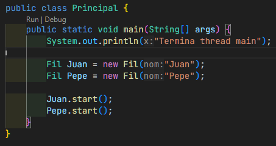
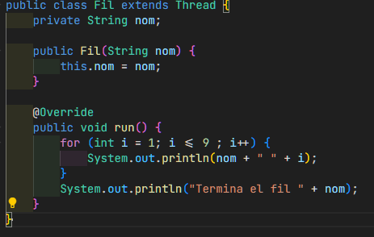
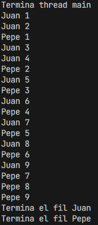
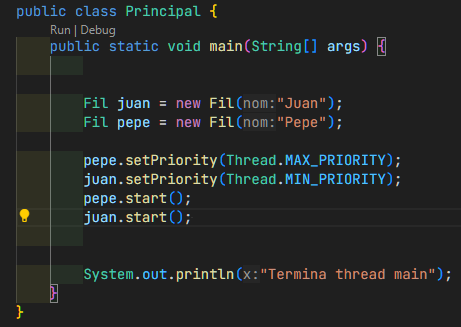
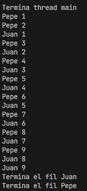
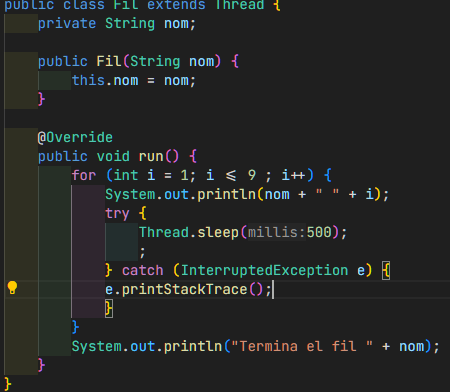
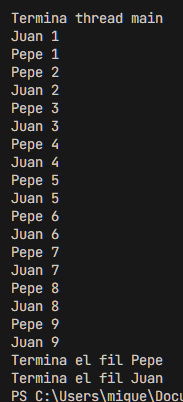

# Actividad 01: Programación de fils

# Comportamiento 1

# Principal

# Fil

# Salida (parecida)

La clase Principal crea e inicia dos hilos llamados "Juan" y "Pepe" utilizando la clase Fil, que extiende Thread. En la clase Fil, el método run es sobrescrito para definir la tarea que realiza cada hilo, que consiste en imprimir su nombre seguido de los números del 1 al 9 y un mensaje indicando que ha terminado. Los hilos se crean y se inician con start().

# Comportamiento 2

# Principal 

# Salida (Parecida)

Se ajustan las prioridades de los hilos con setPriority: "Pepe" recibe la prioridad máxima (Thread.MAX_PRIORITY), mientras que "Juan" tiene la mínima (Thread.MIN_PRIORITY). Al iniciar los hilos con start(), el sistema operativo tiende a ejecutar primero el hilo con mayor prioridad.

# Comportamiento 3

# Fil

# Salida (parecida)

Los hilos imprimen su nombre junto con los números del 1 al 9 en iteraciones. Dentro de cada iteración, se llama a Thread.sleep(500), lo que pausa el hilo durante 500 milisegundos antes de continuar con el siguiente número. Si ocurre una interrupción mientras el hilo está en pausa, se captura y maneja con un bloque try-catch.